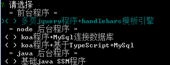

# le-cli
前端工程化：创建项目，自动开发生成脚手架、webpack配置文件；开发完成后构建项目，进行压缩合并，并行生产环境和开发环境。

## 安装
`npm install le-cli -g`

## 使用
直接cd 到自己的文件目录，自己创建一个文件夹：
然后直接运行命令 `le` 就可以了:

## 已添加的项目构建
- 多页jquery程序+handlebars模板引擎
- 基于TypeScript+webpack多页打包的前台程序
- react+redux+antd+jsonServerMockjs
- react+redux+antd+next服务端渲染
- koa程序+MySql连接数据库
- koa程序+基于TypeScript+MySql

## 版本升级说明
- 0.0.8                                                                 
    添加基于next 的react 服务端渲染项目模板。 内置redux+antd， 作为前台程序使用。